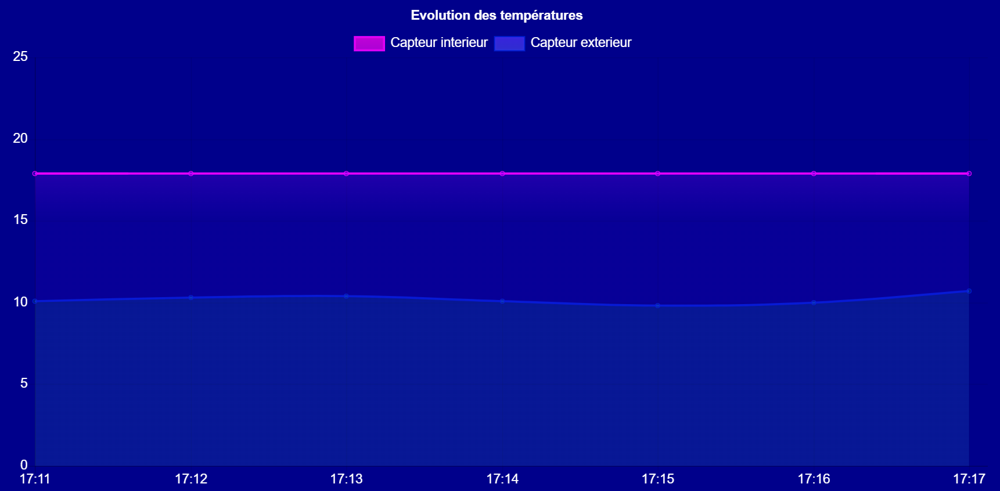

# Hot Hot Hot

# Notice explicative

URL du site  : https://hot-hot-hot.vercel.app

## Accueil
Sur cette page, vous retrouverez les données des capteurs en temps réel, mais également les valeurs minimales et maximales jamais atteintes.

Si vous restez sur cette page vous pourrez visualiser l'évolution des températures sur un graphique dynamique mis à jour toutes les minutes.

## Historique
Sur cette page, vous retrouverez un tableau historique répertoriant toutes les valeurs captées depuis le début.
Vous pouvez librement trier ce tableau selon les colonnes de votre choix.
Cliquer une fois triera par ordre croissant, cliquer de nouveau triera par ordre décroissant.

## Alertes
Cette page répertorie toutes les alertes survenues depuis le début. Vous pouvez comme pour l'historique trier ces alertes selon les critères de votre choix.

## Tests pour les alertes
Les alertes ayant une très faible probabilité de survenir vous pouvez en générer manuellement sur la page dédiée.
Vous avez le choix entre deux alertes.
Elles s'afficheront sur l'historique des alertes et auront exactement le même comportement que les vraies alertes.

## Documentation
Pour consulter notre équipe et nos méthodes de travail.

## Mon Compte
Une page de simulation en vue d'un réel système de connection.
Tout est fictif et la connection ne fonctionne pas.

